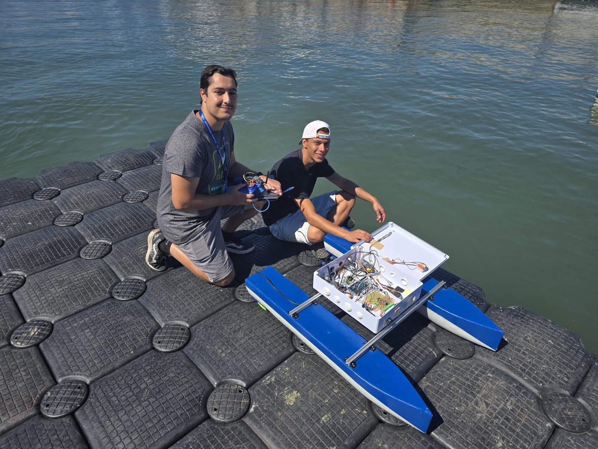

# USV Navigation by Coordinates

## Project Description

This project implements a navigation system for an Unmanned Surface Vehicle (USV) capable of autonomous navigation using GPS coordinates. The system relies on an Arduino Mega for control and navigation. The navigation logic is based on creating vectors between waypoints and maintaining the USV on that line (Vector-based Navigation).

## Key Features

- **Vector-based GPS Navigation**: Uses a Ublox M8N GPS module to navigate between waypoints by following calculated vectors.
- **Motor Control**: Manages motors for propulsion and steering.
- **Data Logging**: A dedicated Arduino Nano receives telemetry from the main controller and stores it on an SD card for later analysis.
- **Web Visualization**: Web tool to visualize the route taken by the USV and verify passage through control points.
- **Test Modes**: Specific codes for water and land testing.

## Hardware Requirements

### Control and Navigation

- **Arduino Mega (Main Controller)**: Handles GPS navigation logic, sensor reading, and actuator control.
- **GPS Module with Compass (Ublox M8N)**: Provides precise global positioning and heading.

### Data Logging

- **Arduino Nano**: Acts as a slave to receive and manage data.
- **SD Card Module**: Interface for saving mission logs.

### Other

- **Motors and Drivers**: (Generic).
- **Power Supply**: Suitable batteries for the USV.

## Project Structure

The repository is organized as follows:

### `Codes/`

Contains source code for microcontrollers.

- **`Arduino_Mega1/`**: **[Tested in Water - Functional]** Main navigation code. Includes mission logic and control. (Operation video available).
- **`Arduino_Mega2_Figures/`**: **[Tested in Water - Functional]** Code to perform specific figures or trajectories.
- **`Arduino_Mega3_MIMO/`**: **[Tested on Land]** MIMO control implementation. Functional in bench tests.
- **`Arduino_Nano/`**: Code for Arduino Nano. Receives data from Mega via serial and saves it to microSD.
- **`Tests/`**: Auxiliary codes to test individual components (motors, sensors, etc.).

### `Web_Viz/`

- **`index.html`**: Web visualization tool. Allows loading logs or defining points to visualize the USV trajectory and validate its behavior regarding expected waypoints.

## Installation and Usage

1.  **Arduino Mega**:

    - Open the desired project (e.g., `Arduino_Mega1`) in Arduino IDE.
    - Install necessary libraries (TinyGPS++, etc., depending on the code).
    - Configure pins and PID constants if necessary.
    - Upload code to Arduino Mega.

2.  **Arduino Nano (Logger)**:

    - Open the project in `Arduino_Nano`.
    - Upload code to Arduino Nano.
    - Ensure SD card is formatted and correctly inserted.

3.  **Visualization**:
    - Open `Web_Viz/index.html` in a modern web browser (Chrome, Firefox).
    - No server installation required, works locally.

## NavalRex25 Participation

The USV team participated in **NavalRex25**, demonstrating the vehicle's capabilities in a real-world environment. We tested previous code versions that were theoretically correct but encountered practical challenges in the field.

**Media Coverage:**
[Escola Náutica reforça presença portuguesa no maior exercício mundial de robótica marítima](https://sapo.pt/artigo/escola-nautica-reforca-presenca-portuguesa-no-maior-exercicio-mundial-de-robotica-maritima-68c435dc0e9d7127e2de960f)

## Challenges and Solutions

### Compass Calibration & Look-Up Table

One of the major challenges encountered during NavalRex25 was a faulty compass. The hardware itself had a defect that caused a constant linear error in the readings, rather than it being an issue of external magnetic interference.

**Solution:**
Since the error was linear and constant, we implemented a **Look-Up Table (LUT)** in software. This allowed us to map the incorrect raw values to the correct geographical heading, effectively calibrating the compass via software.

## License

This project is under the MIT License. See the [LICENSE](LICENSE) file for more details.

---

Copyright (c) 2025 Christian Rodrigues
